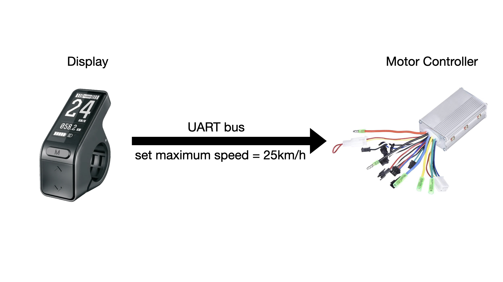

### Section 1 - Introduction
Our goal is to learn how to reverse engineer the [firmware](https://en.wikipedia.org/wiki/Firmware){:target="_blank"} of the Tenways CGO600 and CGO600 Pro's display, and remove the software speed limit. As a requirement, we do not perform any invasive procedures such as opening the display casing or intercepting packets on the display communication [BUS](https://en.wikipedia.org/wiki/Bus_(computing)){:target="_blank"}. 

# Disclaimer
1. Riding an ebike that is not limited to 25 km/h is illegal and dangerous. You should never do it on public roads. If you choose to break the law and ride faster than 25 km/h, you do so at your own risk. 
2. Uploading modified firmware to the ebike's display can potentially break it. In that case, you will have to buy a new display from Tenways. If you choose to upload modified firmware to your ebike, you do so at your own risk.

# Outline of how to achieve the goal
1. Obtain the firmware of the display.
2. Decompile it using [Ghidra](https://ghidra-sre.org/){:target="_blank"}.
3. Find the part of the code that sets the speed limit.
4. Change the assembly instructions of that function to remove the speed limit.
5. Upload the modified firmware to the bike's display via Bluetooth.

# CGO600 system
The CGO600 and CGO600 Pro models have basically the [same parts](https://www.tenways.com/pages/comparison){:target="_blank"}. For the purpose of this guide, they can be considered the same, so from now on we will use "CGO600" to refer to both models. 

The CGO600 ebike system can be reduced to two components for the purpose of this guide: the display and the motor controller. These two components communicate information over [UART](https://en.wikipedia.org/wiki/Universal_asynchronous_receiver-transmitter){:target="_blank"}. The maximum speed is sent by the display to the motor controller. We will modify the code of the display to send an arbitrary maximum speed.



### Section 2 - Obtain the firmware of the display
Our first step is to obtain the firmware that is running on the display. Normally, we would have to connect via [j-link](https://wiki.segger.com/Main_Page){:target="_blank"} directly to the pins of the device to extract the firmware. But we were lucky and Tenways released their firmware online [here](https://tenways.zendesk.com/attachments/token/z8piZJtAIPiQ8BvcSvtylzwfE/?name=SW102-CGO600.zip){:target="_blank"}. We found this information in this [reddit thread](https://www.reddit.com/r/ebikes/comments/un5pq7/tenways_600_speed_hack/){:target="_blank"}. In this thread we also learned that it is possible to upload new firmware to the display via Bluetooth using Nordic's ["DFU updater"](https://www.nordicsemi.com/Products/Development-tools/nRF-Device-Firmware-Update){:target="_blank"} app.

The firmware is packaged as a zip file with the following contents:
```
manifest.json
sw102.bin
sw102.dat
```
The file we are interested in right now is `sw102.bin`, which contains the compiled firmware in binary format.

### Section 3 - Decompile the firmware using Ghidra

### Section 4 - Find the part of the code that sets the speed limit

### Section 5 - Upload the modified firmware to the bike's display via Bluetooth

### Section 6 - Conclusion